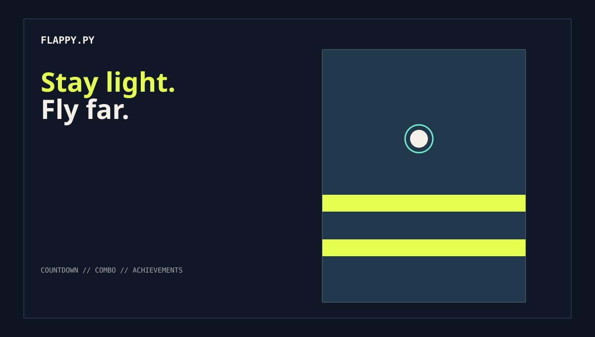
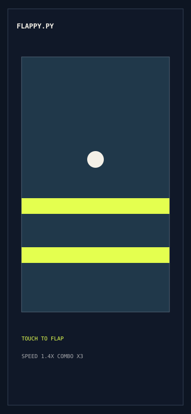

# FlappyPy

> A fast, futuristic Flappy Bird-style browser game built with HTML, CSS, and JavaScript.

[](https://github.com/boundryguy/FlappyPy/actions/workflows/ci.yml)
[](https://boundryguy.github.io/FlappyPy/)
[](VERSION)

## Play

**[Open the live demo](https://boundryguy.github.io/FlappyPy/)**

Or run it locally:

```bash
git clone https://github.com/boundryguy/FlappyPy.git
cd FlappyPy
python3 -m http.server 8000
```

Open <http://localhost:8000> in a browser.

## Highlights

- Responsive canvas gameplay with mouse, touch, and keyboard controls.
- Countdown start sequence, increasing difficulty, pipe patterns, combos, and near-miss bonuses.
- Shield, slow-motion, and score-multiplier power-ups.
- Achievements with persistent progress and unlock notifications.
- Practice mode, bird skins, multiple backgrounds, day/night cycle, rain, and fog.
- Browser-safe Web Audio with background music, mute, separate SFX/music volume, and unlock chimes.
- Game-over screen with final score, best score, restart action, and new-best celebration.

## Controls

| Action | Control |
| --- | --- |
| Flap | `Space`, `ArrowUp`, click, or tap the game frame |
| Pause/resume | `P` or the pause button |
| Restart | Click/tap `RESTART FLIGHT` or press `Space` after game over |
| Secret | Type `FLAPPY` for the hidden bird skin |

## Media





[Animated vector gameplay preview](docs/media/gameplay-preview.svg)

The repository includes lightweight preview artwork in [`docs/media`](docs/media/README.md). For authentic screenshots and a gameplay GIF, capture the live demo at desktop and mobile widths and place the files in that directory using the names documented there.

## Development

This is a dependency-free static site. Edit `index.html`, `style.css`, or `game.js`, then refresh the browser. The CI workflow checks JavaScript syntax, required entry files, and broken local references.

## Contributing

Read [`CONTRIBUTING.md`](CONTRIBUTING.md) before opening an issue or pull request. Bug reports, accessibility improvements, gameplay balancing, and small visual refinements are welcome.

## License

No license has been selected for this repository yet. Do not redistribute the project until a license is added.

## Version

Current release: **0.3.0**. See [`CHANGELOG.md`](CHANGELOG.md) for release notes.
